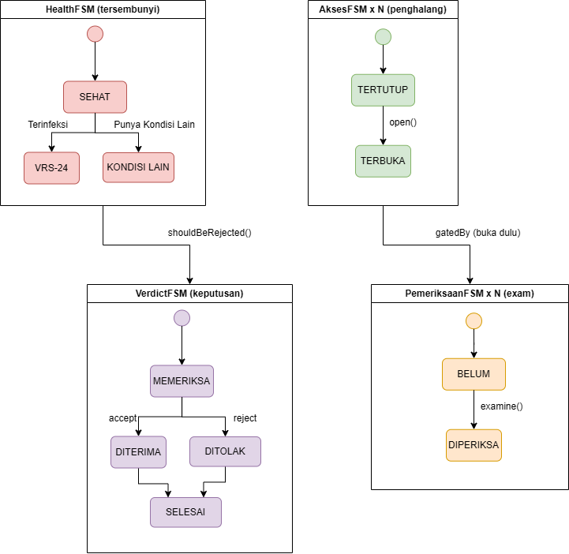
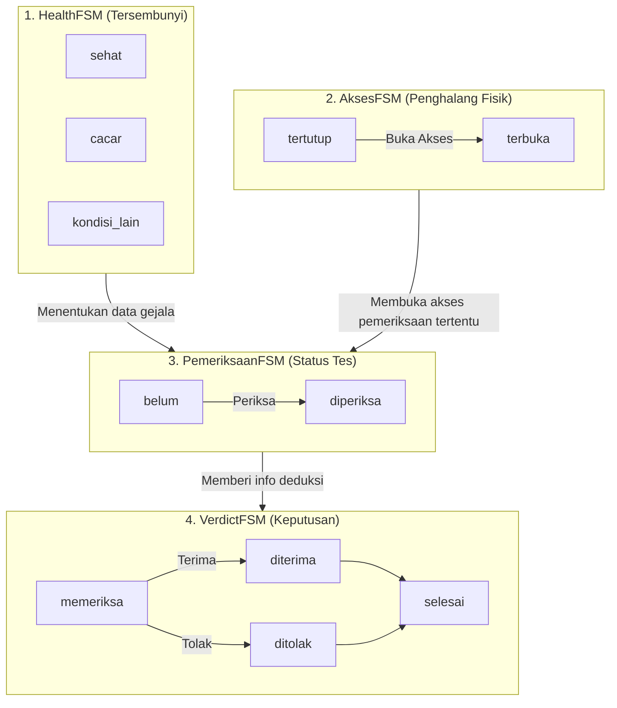

# Please, Let Me In!

**Genre:** *Simulation, Survival Horror, Visual Novel, Social Deduction*

## Deskripsi Game
**Please, Let Me In!** adalah sebuah game simulasi menjadi penjaga rumah susun (Rusun) di mana kota tempat Rusun tersebut berada sedang mengalami *outbreak* wabah akibat kebocoran senjata biologis (*bioweapon*). Pemain bertugas menyaring setiap pengunjung yang ingin memasuki Rusun. Di tengah kepanikan kota, Anda harus mengecek secara teliti semua pengunjung yang masuk untuk memeriksa gejala fisik mereka guna mendeteksi apakah mereka terpapar virus *bioweapon* mematikan **VRS-24** atau tidak.

Setiap pengunjung memiliki kondisi fisik dan motif yang berbeda-beda—ada yang benar-benar sehat, ada yang membawa wabah, dan ada pula yang mencoba berbohong demi perlindungan. Tugas utama Anda adalah melakukan interogasi, membuka pakaian penghalang, mengukur indikator kesehatan medis, dan membuat keputusan krusial: **TERIMA** atau **TOLAK**. Setiap keputusan Anda menentukan kelangsungan hidup para penghuni rumah susun.

---

## Mekanik Game

### 1. Sistem Investigasi dan Pemeriksaan
Setiap pengunjung yang datang membawa klaim atau alasan tersendiri untuk masuk. Pemain dapat melakukan serangkaian tindakan investigasi gratis tanpa batas kuota untuk memverifikasi klaim tersebut:
* **Observasi Awal:** Mengamati penampilan luar pengunjung saat pertama kali datang.
* **Membuka Penghalang Fisik (*Access Barrier*):** Beberapa pengunjung mengenakan pakaian tebal atau aksesoris (masker, syal, jaket, topi, kacamata, *hoodie*) yang menutupi gejala penyakit mereka. Pemain harus menyuruh mereka membukanya sebelum bisa memeriksa area tersebut.
* **Pemeriksaan Medis:** Pemain dapat melakukan berbagai tes kesehatan fisik seperti:
  * Mengukur suhu tubuh (mendeteksi demam).
  * Memeriksa ruam kulit di lengan atau leher.
  * Memeriksa kondisi mata (merah/berair).
  * Mengukur tekanan darah.
  * Memeriksa kerontokan rambut/kondisi kepala.

### 2. Sistem Deduksi Medis (Buku Catatan Pemeriksaan)
Pemain dibekali panduan medis untuk mengenali infeksi **VRS-24 (Cacar)**:
* **Diagnosis Positif VRS-24:** Pengunjung dipastikan terinfeksi jika memiliki **Ruam Menyebar** (banyak bintik) + **Demam Tinggi** (suhu $\ge$ 37.5°C) + minimal **1 Gejala Pendukung** (seperti mata merah, tekanan darah rendah, wajah pucat, atau kebotakan mendadak).
* **Jebakan Medis (*Red Herrings*):** Tidak semua gejala tunggal mengindikasikan infeksi. Gejala tertentu dapat disebabkan oleh kondisi non-menular lain (misalnya lelah/insomnia menyebabkan mata merah, cuaca panas menyebabkan suhu naik sedikit, alergi udang menyebabkan bintik tunggal, atau riwayat imunisasi). Pemain harus jeli melihat pola gejala secara keseluruhan.

### 3. Alur Permainan dan Keputusan
Game berjalan selama satu hari penuh dengan total **6 pengunjung unik**. Keputusan pemain tidak akan langsung dinilai di tempat (*fog of consequence*), sehingga menjaga ketegangan permainan. Rekapitulasi keakuratan semua keputusan baru akan diungkap sepenuhnya di akhir hari ketika hasil tes sebenarnya dibuka.

---

## Penjelasan FSM (Finite State Machine)

Game ini ditenagai oleh **4 Finite State Machine (FSM)** independen yang saling memengaruhi untuk menggerakkan logika simulasi medis, interaksi, dan alur keputusan:

### 1. HealthFSM (FSM Kesehatan Tersembunyi)
FSM ini merepresentasikan kondisi kesehatan "sebenarnya" dari tiap pengunjung. State ini tersembunyi dari pemain dan ditentukan di awal kedatangan pengunjung.
* **State yang ada:**
  * `sehat`: Pengunjung sehat walafiat, tidak memiliki gejala membahayakan.
  * `cacar`: Pengunjung terinfeksi virus VRS-24. Wajib **ditolak**.
  * `kondisi_lain`: Pengunjung tidak terinfeksi virus menular, namun memiliki penyakit lain (seperti *heat-stroke*, anemia, dll.) yang menunjukkan gejala mirip cacar. Wajib **diterima**.
* **Peran:** Menentukan *output* atau data gejala mentah yang akan didapatkan pemain saat melakukan pemeriksaan fisik.

### 2. AksesFSM (FSM Penghalang Fisik)
Mengontrol status pakaian atau aksesoris pelindung yang digunakan pengunjung untuk menutupi tubuh mereka.
* **Transisi State:** `tertutup` $\xrightarrow{\text{minta buka}}$ `terbuka`
* **Peran:** Berfungsi sebagai gerbang pengunci pemeriksaan. Sebagai contoh, pemeriksaan ruam kulit pada lengan berada di bawah kendali AksesFSM jaket; pemain tidak bisa melakukan cek ruam sebelum jaket dibuka.

### 3. PemeriksaanFSM (FSM Status Pemeriksaan)
Melacak status pemeriksaan medis untuk setiap indikator klinis pada pengunjung.
* **Transisi State:** `belum` $\xrightarrow{\text{lakukan tes}}$ `diperiksa`
* **Peran:** Mencatat apakah suatu pemeriksaan telah dilakukan atau belum. Begitu pemeriksaan berganti menjadi `diperiksa`, data klinis yang sesuai dengan `HealthFSM` akan dimasukkan ke dalam log catatan pemain untuk dianalisis.

### 4. VerdictFSM (FSM Keputusan Akhir)
Mengatur alur evaluasi pemain terhadap pengunjung yang sedang dihadapi.
* **Transisi State:** `memeriksa` $\rightarrow$ (`diterima` atau `ditolak`) $\rightarrow$ `selesai`
* **Peran:** Mengunci keputusan pemain (terima/tolak) lalu memicu evaluasi kebenaran keputusan tersebut terhadap status `HealthFSM` sesungguhnya sebelum melanjutkan ke pengunjung berikutnya.

---

## Akhir Permainan (Endings)
Keputusan pemain dalam menyaring ke-6 pengunjung tersebut secara kumulatif akan menentukan akhir dari giliran jaga Anda. Terdapat beberapa variasi akhir cerita yang bisa Anda capai—mulai dari keberhasilan menjaga keamanan apartemen dengan sempurna, terjadinya kebocoran wabah akibat kelalaian pemeriksaan, penolakan yang tidak adil terhadap warga sehat, hingga akhir rahasia yang tidak terduga. Lakukan pemeriksaan dengan teliti dan jangan biarkan wabah masuk!